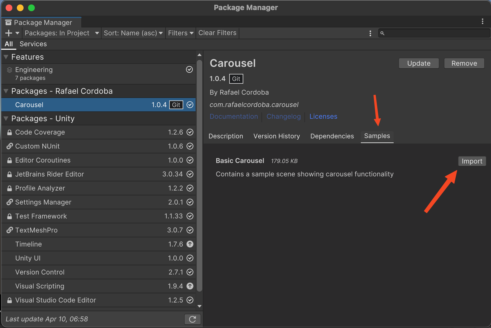

# Carousel

A customizable 3D carousel for Unity.

## Installation

### Via Git URL

1. This approach is for using the package in a Unity project
2. Open the Package Manager in Unity (Window > Package Manager)
2. Click the "+" button in the top-left corner
3. Select "Add package from git URL..."
4. Enter the following URL:
   ```
   https://github.com/rafaelcordoba/Carousel.git?path=Packages/com.rafaelcordoba.carousel
   ```
5. Click "Add"
6. In the Samples tab, download Basic Carousel



### Via Git Checkout

1. This approach is for developing the package
2. `git clone https://github.com/rafaelcordoba/Carousel.git`
3. Open the Unity project

## Documentation

### Configurations
- The config files are found in `Assets/Carousel/Configs`
- While playing the game, you can change the configuration values in the inspector.
- The changes can be seen immediately in the game to help you find the best values.
- Make sure you have selected the config tha matches the loaded carousel.

### Carousel Instantiation
- [CarouselLoader](https://github.com/rafaelcordoba/Carousel/blob/main/Assets/Carousel/Scripts/CarouselLoader.cs) has a method called `LoadCarousel` that shows how instantiate a carousel.
- You can choose between static or animated carousel.
- You can also choose to add swipe gestures support or not.

### Sample Data
- The sample data is found in `Assets/Carousel/Data`
- You have to choose a default prefab
- You can also choose a custom prefab for each data item
- For the sake of serialization simplicity, the different types of item views cannot be mixed, but they can be one after the other.
- The carousel supports different item views intercalating with each other.

## Automation
### GitHub Actions
- The project uses GitHub Actions to automate copying sample assets to the package Samples~ folder
- This is required so Unity can show the samples in the Package Manager while allowing the samples to be worked in this repository

## License

This package is licensed under the Creative Commons Attribution-NonCommercial 4.0 International License. See the [LICENSE.md](LICENSE.md) file for details.

[](https://creativecommons.org/licenses/by-nc/4.0/) 